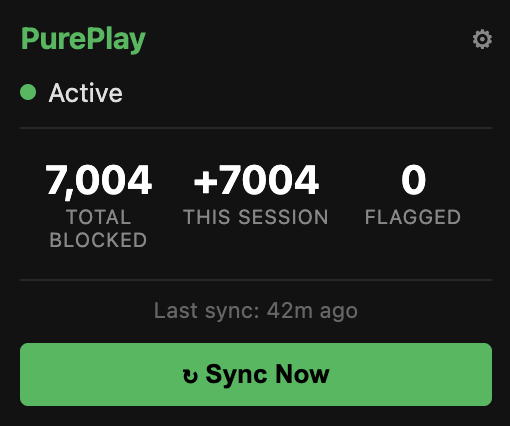
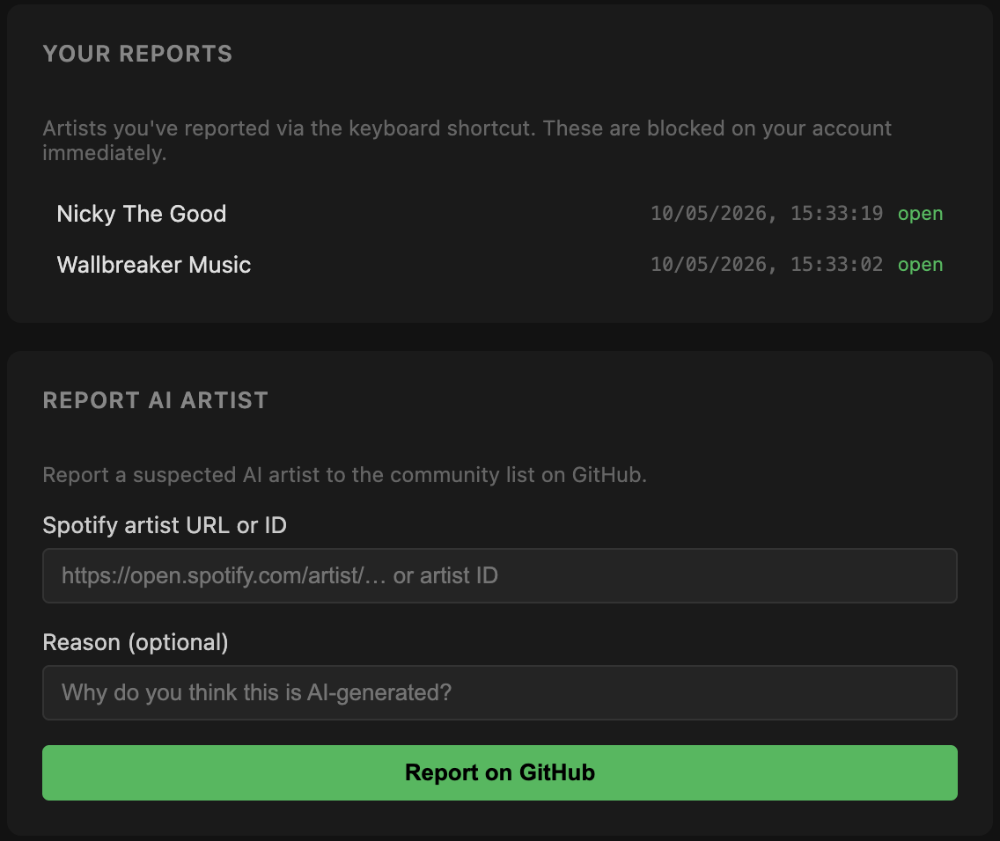
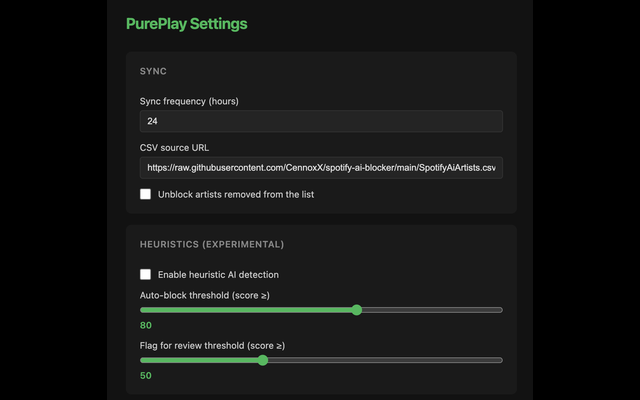

# PurePlay - Block AI Artists on Spotify

**PurePlay** is a free Chrome extension that automatically blocks AI-generated artists from your Spotify account. Once installed, it works silently in the background - no maintenance needed.

---

## What It Does

Spotify is increasingly filled with AI-generated "artists": algorithmically produced music with fake names designed to game streaming payouts and crowd out real musicians. PurePlay uses a community-maintained list of these artists and blocks them from your Spotify account automatically.

- Blocks thousands of known AI artists from your Spotify account
- Syncs automatically whenever you open Spotify
- Updates as the community list grows - no action needed from you
- Lets you whitelist artists you want to keep
- Lets you report suspected AI artists back to the community



---

## Installation

> PurePlay is not yet on the Chrome Web Store - it's coming soon. In the meantime, here's how to install it manually. It takes about 5 minutes and you only have to do it once.

---

### Step 1 - Download the extension

1. Go to the [**Releases page**](https://github.com/AsTheSeaRises/PurePlay/releases)
2. Click on the most recent release (at the top of the list)
3. Scroll down to the **Assets** section and click **pureplay-v1.0.0.zip** to download it

A file called `pureplay-v1.0.0.zip` will appear in your Downloads folder.

---

### Step 2 - Unzip the file

**On a Mac:**
- Double-click the zip file in your Downloads folder. A new folder called `pureplay-v1.0.0` will appear next to it.
- Move that folder somewhere permanent - for example, drag it to your **Documents** folder.

**On Windows:**
- Right-click the zip file and choose **Extract All…**
- Click **Extract**. A new folder called `pureplay-v1.0.0` will appear.
- Move that folder somewhere permanent - for example, drag it to your **Documents** folder.

> **Important:** Don't delete or move this folder after installation. Chrome needs it to stay in the same place.

---

### Step 3 - Open Chrome's Extensions page

1. Open **Google Chrome**
2. In the address bar at the top, type: `chrome://extensions` and press **Enter**

You'll see a page titled "Extensions".

---

### Step 4 - Turn on Developer Mode

Look in the **top-right corner** of the Extensions page. You'll see a switch labelled **Developer mode**.

Click it to turn it **on**. (The switch will turn blue and a few new buttons will appear.)

---

### Step 5 - Load PurePlay

1. Click the **Load unpacked** button that just appeared in the top-left
2. A folder browser window will open
3. Navigate to the `pureplay-v1.0.0` folder you saved in Step 2, and open it
4. Inside that folder, click on the folder named **`dist`** to select it
5. Click **Select** (Mac) or **Select Folder** (Windows)

PurePlay will now appear in your extensions list with a green checkmark.

---

### Step 6 - Pin PurePlay to your toolbar (recommended)

1. Look for the **puzzle piece icon** (🧩) in the top-right corner of Chrome, next to the address bar
2. Click it - a list of your extensions will appear
3. Find **PurePlay** in the list and click the **pin icon** (📌) next to it

The PurePlay icon will now always be visible in your Chrome toolbar.

---

## First Use

1. Open [Spotify Web Player](https://open.spotify.com) in Chrome
2. Log in if you aren't already
3. PurePlay will automatically detect your session and begin syncing

That's it. The first sync will block all currently known AI artists. You'll see the count in the PurePlay popup (click the icon in your toolbar).

---

## Keyboard Shortcut

While listening on Spotify, press the shortcut to instantly report and block the currently playing artist.

**Default shortcut:**
- **Mac:** `Cmd+Shift+Y`
- **Windows/Linux:** `Ctrl+Shift+Y`

**What happens:**
- The artist is immediately blocked on your Spotify account
- A green confirmation message briefly appears on screen
- A new tab opens with a pre-filled GitHub report form — submit it to flag the artist for the community list
- The report is saved to **Settings → Your Reports** with a timestamp



**Change the shortcut:**
1. In Chrome, go to `chrome://extensions/shortcuts`
2. Find **PurePlay — Block AI Artists on Spotify**
3. Click the pencil icon next to "Report the currently playing Spotify artist"
4. Press your preferred key combination

> Note: some shortcuts may conflict with Spotify or Chrome. If pressing the shortcut seems to do nothing or skips the track, try a different combination.

---

## Understanding the Popup

Click the PurePlay icon in your Chrome toolbar to open the popup:

| Item | What it means |
|---|---|
| **Active** (green dot) | Extension is running normally |
| **Active (with errors)** (yellow dot) | Something went wrong - see the error message below |
| **Syncing…** (animated dot) | Currently checking for new AI artists to block |
| **Total blocked** | How many AI artists have been blocked on your account |
| **This session** | Artists blocked since you last opened Spotify |
| **Flagged for review** | Artists detected as *possibly* AI but not yet blocked - you decide |
| **Last sync** | When PurePlay last checked for updates |
| **↻ Sync Now** | Manually trigger a sync right now |
| **⚙ Settings** | Open the full settings page |

---

## Settings Page

Open PurePlay's settings by clicking **⚙ Settings** in the popup, or right-clicking the extension icon and choosing **Options**.



### Sync settings

- **Sync frequency:** How often PurePlay checks for new AI artists (default: every 24 hours)
- **CSV source URL:** The community list it syncs from. You can point this at a custom list if you have one
- **Unblock artists removed from the list:** If an artist gets removed from the community list, PurePlay will unblock them automatically

### Heuristics (experimental)

PurePlay can also *detect* AI artists it hasn't seen before by analysing patterns in their music and metadata. This is off by default.

- **Enable heuristic AI detection:** Turn on the experimental detector
- **Auto-block threshold:** Artists scoring above this confidence level get blocked automatically
- **Flag for review threshold:** Artists scoring above this level appear in the popup for you to review manually

### Whitelist

Artists on your whitelist will never be blocked, even if they appear on the community list.

- Paste Spotify artist IDs (one per line) to protect specific artists
- Use **Import / Export** to back up or restore your whitelist

### Blocked Artists Viewer

See a full list of every artist PurePlay has blocked on your account. You can search by name or ID.

### Report AI Artist

Found an AI artist that isn't on the list yet? Report it to the community.

1. Paste the artist's Spotify URL or ID into the field
2. Add an optional reason
3. Click **Report on GitHub** - this opens a pre-filled GitHub issue for the community to review

---

## How to Find a Spotify Artist ID

You need the Artist ID to add someone to your whitelist or to report them. Here's the easiest way to find it:

### Using the Spotify Web Player (easiest method)

1. Go to [open.spotify.com](https://open.spotify.com) and search for the artist
2. Click on their name to open their artist page
3. Look at the **address bar** in your browser

The URL will look like this:

```
https://open.spotify.com/artist/4Z8WiqH9PZ97uS6Z2MjaSI?si=...
```

The Artist ID is the string of characters **between `/artist/` and the `?`**.

In the example above: **`4Z8WiqH9PZ97uS6Z2MjaSI`**

> The ID is always exactly 22 characters, containing only letters and numbers.

---

## Frequently Asked Questions

**Is there a keyboard shortcut to report an artist?**
Yes. Press **Cmd+Shift+Y (Mac)** or **Ctrl+Shift+Y (Windows)** while a track is playing on Spotify. The artist is blocked on your account immediately, a green confirmation appears, and a new tab opens with a pre-filled GitHub report form. You can rebind the shortcut at `chrome://extensions/shortcuts`.

**Does PurePlay access my Spotify password or payment info?**
No. It only reads the temporary session token that Spotify Web Player creates when you log in. This is the same kind of token Spotify uses internally to load your library.

**Will it slow down Spotify?**
No. PurePlay runs in the background and only contacts Spotify briefly during sync. You won't notice any difference.

**How does it actually block artists?**
It uses the same "block artist" feature built into Spotify - the same one you'd use if you right-clicked an artist and chose "Don't play this artist". PurePlay just does it in bulk automatically.

**Can I undo the blocks?**
Yes. You can unblock artists directly in Spotify (artist page → three dots → Unblock). You can also enable "Unblock artists removed from the list" in settings, which will automatically unblock artists if they're ever removed from the community list.

**What is the community list?**
It's a CSV file maintained by the [CennoxX/spotify-ai-blocker](https://github.com/CennoxX/spotify-ai-blocker) project. Anyone can submit new artists via GitHub Issues. PurePlay checks this list for updates every 24 hours by default.

**I whitelisted an artist and they still got blocked. Why?**
Make sure you saved the settings after adding them to the whitelist. Also check that the ID you entered is correct - use the steps above to find the exact ID from the Spotify URL.

**The popup shows "No auth token". What do I do?**
This means PurePlay hasn't captured your Spotify session yet. Make sure you have Spotify Web Player open at [open.spotify.com](https://open.spotify.com) in the same Chrome window, and that you're logged in. Try refreshing the Spotify tab. If the error persists, try clicking "Clear all data & reset" in Settings, then refresh Spotify.

**What are Heuristics and how do they work?**
Heuristics is an experimental feature (off by default) that lets PurePlay detect AI artists it hasn't seen before — without waiting for the community list to be updated. Enable it in Settings.

When you browse Spotify, PurePlay spots artist links on the page and scores each new artist against six signals:

| Signal | Max score | What it looks for |
|---|---|---|
| Name patterns | 10 | All-lowercase names, words like "lofi", "chill", "beats", "vibes" |
| Low followers | 10 | Under 100 followers but still appearing in recommendations |
| No social links | 15 | Only has a Spotify profile — no external links at all |
| Catalogue velocity | 30 | 16+ tracks per month, or 50+ tracks released in under 3 months |
| Track duration clustering | 20 | All tracks 2–3 minutes with suspiciously low variation |
| No genre tags | 15 | Zero or one genre listed |

Scores are 0–100. What happens next depends on your thresholds in Settings:
- **≥ Auto-block threshold** (default 80): blocked on your Spotify account immediately
- **≥ Flag threshold** (default 50): added to "Flagged for review" in the popup for you to decide

**Does heuristic blocking open a GitHub report?**
No — heuristic blocks are silent and local only. Only the manual keyboard shortcut (`Cmd/Ctrl+Shift+Y`) opens a GitHub issue to notify the community.

---

## Contributing

Found an AI artist not on the list? Use the **Report AI Artist** feature in the settings page, or open an issue directly on the [community list repo](https://github.com/CennoxX/spotify-ai-blocker/issues/new).

---

## References

- [AI-generated tracks represent 44% of new uploaded music — Deezer Newsroom (April 2026)](https://newsroom-deezer.com/2026/04/ai-generated-tracks-represent-44-of-new-uploaded-music/#:~:text=Deezer%2C%20is%20receiving%20nearly%2075%2C000,synthetic%20content%20on%20the%20platform.)
- [Spotify has deleted 75M+ spammy tracks and unveils new AI music policies — Music Business Worldwide](https://www.musicbusinessworldwide.com/spotify-has-deleted-75m-spammy-tracks-as-it-unveils-new-ai-music-policies/#:~:text=Spotify%20has%20removed%20more%20than,generated%20content%20on%20its%20service.)

---

## Acknowledgements

The artist blocklist is maintained by the community at [CennoxX/spotify-ai-blocker](https://github.com/CennoxX/spotify-ai-blocker). PurePlay is just a more convenient way to use it.
